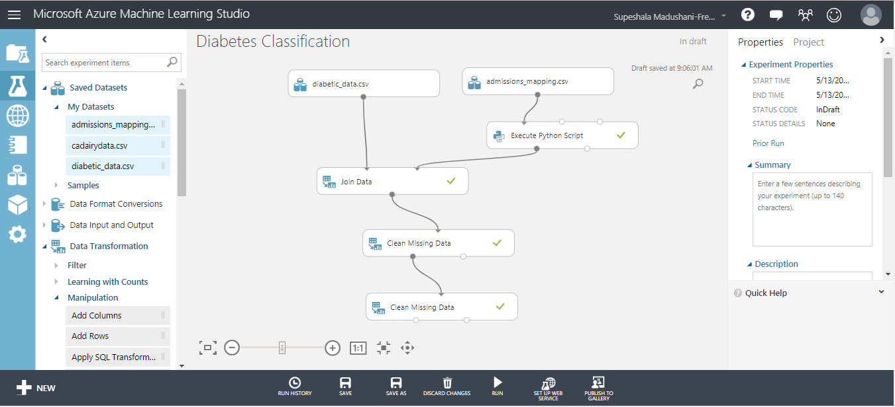
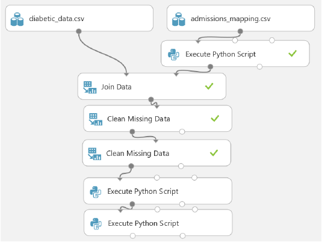
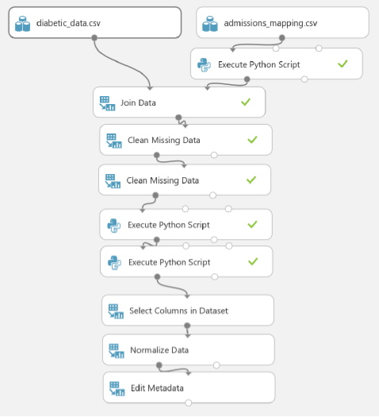
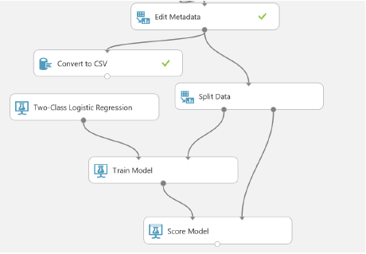
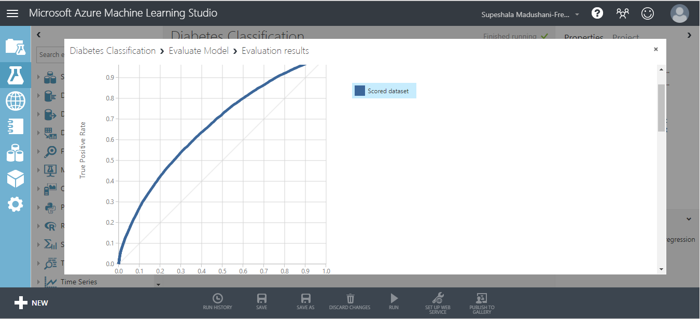
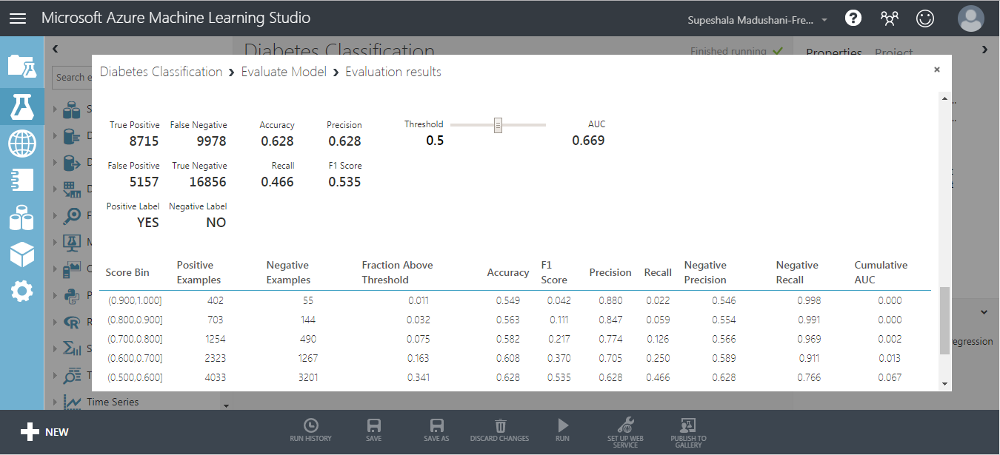

# Diabetes-Classification
This project relies on training and evaluating a classification model to predict which hospitalized diabetes patients will be readmitted for their conditions at a later date. To achieve this purpose, we used a dataset that contains records of diabetes patients admitted to US hospitals. Readmission of patients is both a metric of potential poor care as well as a financial burden to patients, insurers, governments and health care providers.
 
 ### Prerequisites
 - An Azure ML account
 - A web browser and Internet connection
 
 Here, we use the dataset provided to categorize the diabetes patients. The steps in this process includes,
 1. Prepare the dataset for analysis
 2. Investigate relationships in the data set with visualization using custom Python code.
 3. Create a two-class logistic classification model.
 4. Evaluate the performance to the classification model.
 
 ### Prepare the Dataset with Python
 First of all, upload the two datasets naming diabetic_data.csv and admissions_mapping.csv. Then the following code creates consistent coding for missing values by mapping any of the multiple missing values codes to `unknown`.
 ```
def prep_admissions(admissions):
import pandas as pd
admissions['admission_type_description'] = ['unknown' if ((x in ['Not Available', 'Not Mapped', 'NULL']) | (pd.isnull(x))) else x
for x in admissions['admission_type_description']]
return admissions
def azureml_main(df):
df = prep_admissions(df)
return df

 ```
 The Azure Machine Learning experiment should look like the following image upto this point. 
 

```
def create_map():
    ## List of tuples with name and number of repititons.
    name_list = [('infections', 139),
                ('neoplasms', (239 - 139)),
                ('endocrine', (279 - 239)),
                ('blood', (289 - 279)),
                ('mental', (319 - 289)),
                ('nervous', (359 - 319)),
                ('sense', (389 - 359)),
                ('circulatory', (459-389)),
                ('respiratory', (519-459)),
                ('digestive', (579 - 519)),
                ('genitourinary', (629 - 579)),
                ('pregnancy', (679 - 629)),
                ('skin', (709 - 679)),
                ('musculoskeletal', (739 - 709)),
                ('congenital', (759 - 739)),
                ('perinatal', (779 - 759)),
                ('ill-defined', (799 - 779)),
                ('injury', (999 - 799))]
    ## Loop over the tuples to create a dictionary to map codes 
    ## to the names.
    out_dict = {}
    count = 1
    for name, num in name_list:
        for i in range(num):
          out_dict.update({str(count): name})  
          count += 1
    return out_dict
  

def map_codes(df, codes):
    import pandas as pd
    col_names = df.columns.tolist()
    for col in col_names:
        temp = [] 
        for num in df[col]:           
            if ((num is None) | (num in ['unknown', '?']) | (pd.isnull(num))): temp.append('unknown')
            elif(num.upper()[0] == 'V'): temp.append('supplemental')
            elif(num.upper()[0] == 'E'): temp.append('injury')
            else: 
                lkup = num.split('.')[0]
                temp.append(codes[lkup])           
        df.loc[:, col] = temp               
    return df 

def azureml_main(df):
    col_list = ['diag_1', 'diag_2', 'diag_3']
    codes = create_map()
    df[col_list] = map_codes(df[col_list], codes)
    return df
    
```
This code deals with some non numeric coding for special diagnostic codes, and transforms numeric codes by indexing a vector of the text codes. Then the following code transforms the three categories in the label column (No, <30, >30) to two categories. This is required to support a two-class classification model.  
```
def set_readmit_class(x):
    return ['NO' if (y == 'NO') else 'YES' for y in x]

def azureml_main(df):
    df['readmitted'] = set_readmit_class(df['readmitted'])
    return df

```
At this moment the experiment on Azure Machine Learning Studio looks like this.


Then add Normalize data and edit metadata module to the experiment and finally the experiment will look like this.


### Building a Classification Model

Here use two-class logistic regression as the machine learning classifier.
Add a Split data and two class logistic regression module to the experiment. 
Set the Properties of the Split Data module as follows:
- Splitting mode: Split Rows
- Fraction of rows in the first output: 0.6
- Randomized split: Checked
- Random seed: 123
- Stratified split: False
Then add two Class Logistic Regression module to the experiment and set its properties as follows:
- Create trainer mode: Single Parameter
- Optimization tolerance: 1E-07
- L1 regularization weight: 0.001
- L2 regularization weight: 0.001
- Memory size for L-BFGS: 20
- Random number seed: 1234
- Allow unknown categorical levels: checked
Finally add train module and score module to the experiment. Then the experiment will looks like this.



### Evaluate the Model






